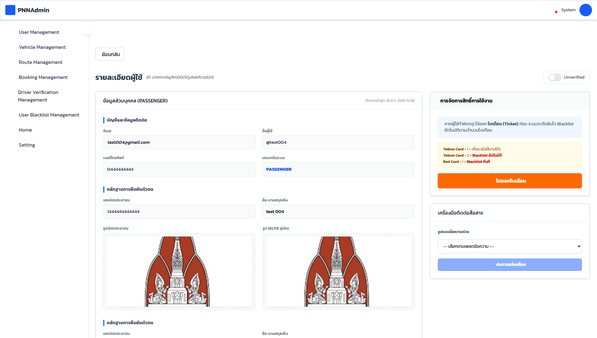

บริเวณด้านขวาของหน้าจอจะเป็นส่วน “การจัดการสิทธิ์การใช้งาน” ซึ่งในเวอร์ชันปรับปรุงนี้ ระบบได้เพิ่มฟีเจอร์ การออกใบเตือน (Ticket) เข้ามา เพื่อใช้เป็นขั้นตอนก่อนการดำเนินการ Blacklist
โดยมีหลักการทำงานดังนี้:
•	หากผู้ใช้งานกระทำผิด ผู้ดูแลควรออก “ใบเตือน (Ticket)” ก่อน
•	ระบบจะพิจารณาการ Blacklist ตามจำนวนใบเตือนที่ได้รับ
กฎของระบบใบเตือน
•	Yellow Card × 1 = ใบเตือน (ยังสามารถใช้งานได้)
•	Yellow Card × 2 = Blacklist อัตโนมัติ
•	Red Card × 1 = Blacklist ทันที
ผู้ดูแลสามารถกดปุ่ม “ไปออกใบเตือน” เพื่อเข้าสู่หน้าสำหรับออกใบเตือนให้ผู้ใช้งาน
หน้าสร้างใบเตือน (Ticket)

เมื่อเข้าสู่หน้าการออกใบเตือน ระบบจะแสดงองค์ประกอบสำคัญดังนี้:
1. กฎการออกใบเตือน
ระบบจะแสดงเงื่อนไขการให้ใบเตือนอีกครั้ง เพื่อช่วยให้ผู้ดูแลตัดสินใจได้อย่างถูกต้อง ได้แก่:
•	ใบเหลืองครั้งที่ 1: ใช้เป็นการเตือน
•	ใบเหลืองครั้งที่ 2: Blacklist อัตโนมัติ
•	ใบแดง: Blacklist ทันที
2. การแจ้งเตือนสถานะผู้ใช้งาน
หากผู้ใช้งานเคยได้รับใบเตือนมาก่อน ระบบจะแสดงข้อความแจ้งเตือน เช่น:
ผู้ใช้มีใบเหลืองแล้ว 1 ใบ การออกใบเตือนครั้งถัดไปจะทำให้ถูก Blacklist อัตโนมัติ
เพื่อช่วยลดความผิดพลาดในการตัดสินใจของผู้ดูแลระบบ
3. การเลือกประเภทใบเตือน
ผู้ดูแลต้องเลือกประเภทของใบเตือน โดยมี 2 รูปแบบ ได้แก่:
•	ใบเหลือง (Yellow Card)
ใช้สำหรับการตักเตือน ผู้ใช้งานยังสามารถใช้งานระบบได้
•	ใบแดง (Red Card)
ใช้ในกรณีที่มีความผิดร้ายแรง โดยระบบจะทำการ Blacklist ทันที
4. การเลือกประเภทความผิด (บังคับกรอก)
ในหัวข้อ “ประเภทความผิด (ตาม ROLE: PASSENGER)”
ผู้ดูแลต้องเลือกประเภทความผิดจากรายการที่ระบบกำหนด เช่น:
• ก่อกวน / ทำลายทรัพย์สินในรถ
• ค้างชำระค่าบริการ / เรียกแล้วไม่มา
• ใช้คำพูดไม่สุภาพ / ดูหมิ่นคนขับ
• พยายามใช้ไอดีคนอื่นเดินทาง
• แจ้งความเท็จ / ก่อกวนระบบ
• อื่น ๆ (ระบุเพิ่มเติมด้านล่าง)
ระบบจะไม่อนุญาตให้ดำเนินการ หากยังไม่ได้เลือกประเภทความผิด
5. รายละเอียดเพิ่มเติม (บังคับกรอก)
ผู้ดูแลต้องระบุรายละเอียดเพิ่มเติมเกี่ยวกับเหตุการณ์ เช่น:
• รายละเอียดเหตุการณ์
• วันที่และเวลาที่เกิดเหตุ
• หลักฐานอ้างอิง (ถ้ามี)
ข้อมูลนี้จะถูกบันทึกเพื่อใช้เป็นหลักฐานและสามารถตรวจสอบย้อนหลังได้
6. การดำเนินการออกใบเตือน
เมื่อกรอกข้อมูลครบถ้วนแล้ว:
1.	ปุ่มสำหรับออกใบเตือนจะสามารถกดได้
2.	เมื่อกดดำเนินการ ระบบจะ:
o	บันทึกข้อมูลใบเตือนลงในระบบ
o	อัปเดตจำนวนใบเตือนของผู้ใช้งาน
o	ตรวจสอบเงื่อนไขเพื่อดำเนินการอัตโนมัติ:
	หากเป็นใบเหลืองใบที่ 2 → Blacklist อัตโนมัติ
	หากเป็นใบแดง → Blacklist ทันที
7. ประวัติการได้รับใบเตือน
บริเวณด้านขวาของหน้าจอจะแสดงประวัติการได้รับใบเตือนของผู้ใช้งาน โดยประกอบด้วย:
• ประเภทใบเตือน (Yellow / Red)
• เหตุผลที่ได้รับ
• ผู้ดำเนินการ (Admin)
• วันและเวลา
รวมถึงสรุปจำนวนใบเตือนทั้งหมด เช่น:
•	จำนวนใบเหลือง
•	จำนวนใบแดง

